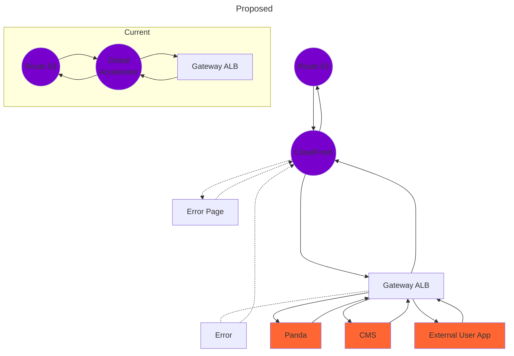

Error Page

Nial has a mockup and UX will look into a nice one
Nial will talk to other front end end teams
I'll catch up with Dan and PD on the CloudFront stuff

## Route 53
Hosted Zone - ipims-staging.r7ops.com
gateway.ipims-staging-1.us-east-1.ipims-staging.r7ops.com - 13.248.149.237, 76.223.21.124

A record
gateway-override-dns.ipims-staging-1.us-east-1.ipims-staging.r7ops.com
maps to k8s-default-gatewayp-ac90894057-1302389486.us-east-1.elb.amazonaws.com.

New A Record
gateway-cdn.ipims-staging-1.us-east-1.ipims-staging.r7ops.com
maps to https://d2bwyvczkc8on4.cloudfront.net, test-dyn-cdn.ipims-staging-1.us-east-1.ipims-staging.r7ops.com

## Global Accelerator
Set with two static IPs - pints to the Gateway ALB
ipims-staging-1-gateway-ga
13.248.149.237
76.223.21.124

| Tags | |
| - | - |
| Cost_Product | platform |
| Owner_Slack | ipims-dev |
| Owner_Practice | Platform |
| Environment | Staging |
| Terraform_Directory | tf-ipims/staging/k8s/application |

## Cloudfront
This would require an update to all front end code. It handles the eventuality that the services can't respond. 
All cookies and headers would need to be forwarded to the new origin
test-dyn-cdn.ipims-staging-1.us-east-1.ipims-staging.r7ops.com

| Item | Value |
| ---- | ---- |
| Name | E3ROOQ118ODZC5 |
| ARN | arn:aws:cloudfront::529124731694:distribution/E3ROOQ118ODZC5 |
| Distribution domain name | https://d2bwyvczkc8on4.cloudfront.net |
| Alternate domain name | test-dyn-cdn.ipims-staging-1.us-east-1.ipims-staging.r7ops.com |

Need a cloudfront WAF - Web ACL - see storybook
Need a security group on the ALB
## Spring errors
Implement this first, perhaps.

## Gateway ALB
k8s-default-gatewayp-ac90894057 - panda-app
k8s-default-gatewayp-ac90894057-1302389486.us-east-1.elb.amazonaws.com - port 80
k8s-default-gatewayp-ac90894057-1302389486.us-east-1.elb.amazonaws.com - port 443

## IT Manage ingress for prod
Who replace James Gillespie?

test-cdn.ipims-staging-1.us-east-1.ipims-staging.r7ops.com/panda/img/appsec.png