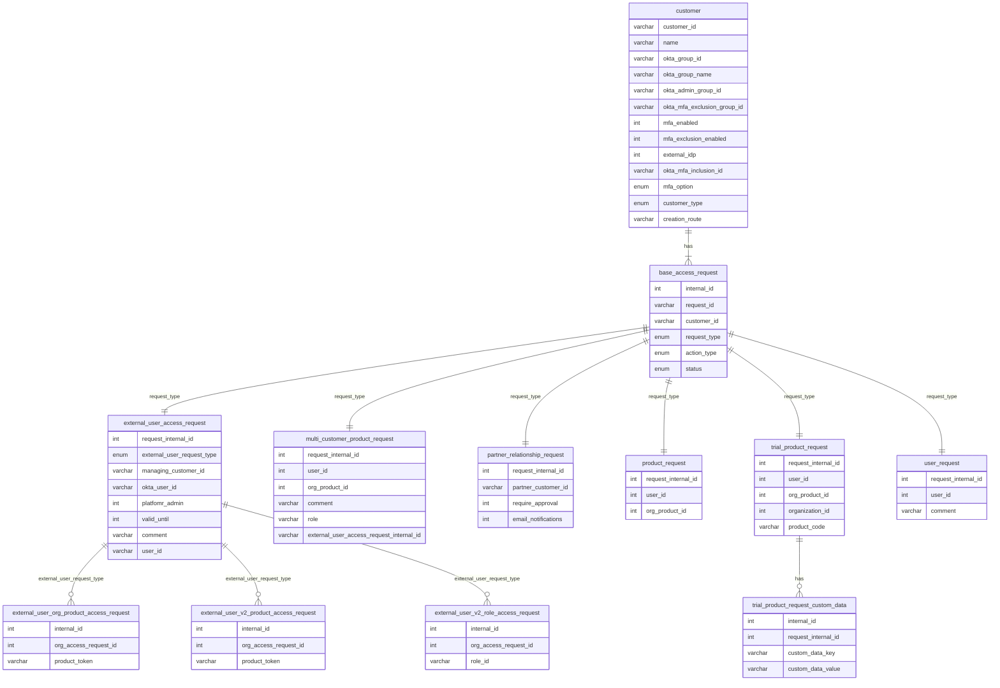

## panda-app
| Controller | End Point | Service |
| ---- | ---- | ---- |
| OpenAccessRequestController | /accessRequests/openUser | productRequestService.getOpenUserAccessRequests(customerId) |
| OpenProductAccessRequestController | /productRequest/openProductAccess | productRequestService.getOpenProductAccessRequests(customerId) |
|  | /productRequest/openTrial | productRequestService.getOpenTrialProductRequests(customerId) |
|  | /ProductRequest/openMultiCustomer | productRequestService.getOpenMultiCustomerProductRequests(customerId) |
### CustomerAccessRequestService

 
### ProductRequestService

## ipims-product-request-app

| Controller | End Point | Service |
| ---- | ---- | ---- |
| OpenCustomerAccessRequestController | /openCustomerAccess/customer/{customerId} | customerAccessRequestService.getOpenCustomerAccessRequests(customerId) |
| OpenProductAccessController | /openProductRequest/customer/{customerId} | productRequestService.getOpenProductRequests(customerId) |
| OpenProductTrialAccessController | /openProductTrialRequest/customer/{customerId} | productTrialRequestService.getOpenTrialProductRequests(customerId) |
| OpenUserAccessRequestController | /openUserRequest/customer/{customerId} | userRequestService.getOpenRequestsForCustomer(customerId) |

 
 
## platform-customer-app

Existing request functionality depends upon a request type - `T extends AccessRequest`. These types come from `ipims-access-request-domain`. Each request type is dealt with by a different service select depending on the incoming type.

### General Principles
The DAOs are defined in `ipims-access-request-domain`. The entities are defined in `platform-customer-app`. Customer app also defines a number of converters to convert between the entities and the DAOs.
#### ExternalUserAccessRequestService
Typically returns a list of `ExternalUserRequest` objects. `ExternalUserRequest` extends `AccessRequest`.
`findOpenRequestsByCustomerId(String customerId)` with access request type EXTERNAL_USER_ACCESS_REQUEST
#### MultiCustomerProductAccessRequestService
Typically returns a list of `MutliCustomerProductRequest`. `MutliCustomerProductRequest` extends `AccessRequest`.
`findOpenRequestsByCustomerId(String customerId)` with access request type MULTI_CUSTOMER_PRODUCT_REQUEST
#### PartnerRelationshipAccessRequestService
Typically returns a list of `PartnerRelationshipRequest` objects. `PartnerRelationshipRequest` extends `AccessRequest`.
`findOpenRequestsByCustomerId(String customerId)` with access request type PARTNER_RELATIONSHIP
#### ProductAccessRequestService
Typically returns a list of `ProductRequest`. `ProductRequest` extends `AccessRequest`.
`findOpenRequestsByCustomerId(String customerId)` with access request type PRODUCT_REQUEST
#### TrialProductAccessRequestService
Typically returns a list of `TrialProductRequest` objects. `TrialProductRequest` extends `AccessRequest`.
`findOpenRequestsByCustomerId(String customerId)` with access request type TRIAL_PRODUCT_REQUEST
#### UserAccessRequestService
Typically returns a list of `UserRequest`. `UserRequest` extends `AccessRequest`.
`findOpenRequestsByCustomerId(String customerId)` with access request type USER_REQUEST

### iPIMS Product Request App
#### ipims-access-request-client
Defined:
- `OPEN_PRODUCT_REQUEST_SERVICE_ENDPOINT`
	- http://%s/api/1/openProductRequest
- `OPEN_PRODUCT_TRIAL_REQUEST_SERVICE_ENDPOINT`
	- http://%s/api/1/openProductTrialRequest
- `OPEN_USER_ACCESS_REQUEST_SERVICE_ENDPOINT`
	- http://%s/api/1/openUserRequest
- `OPEN_CUSTOMER_ACCESS_REQUEST_SERVICE_ENDPOINT`
	- http://%s/api/1/openCustomerAccess
All point to `PRODUCT_REQUEST_SERVICE_APP_NAME`

#### ipims-product-request-app
- http://%s/api/1/openProductRequest
	- OpenProductAccessController
	- Calls `productRequestService.getOpenProductRequests()`
	- Request type `PRODUCT_REQUEST`
	- returns `List<UserProductAccessRequestOpen>`
- http://%s/api/1/openProductTrialRequest
	- OpenProductTrialAccessController
	- Calls `productTrialRequestService.getOpenTrialProductRequests()`
	- Request type ``
	- returns `List<TrialProductRequestOpen>`
- http://%s/api/1/openUserRequest
	- OpenUserAccessRequestController
	- Calls `userRequestService.getOpenRequestsForCustomer()`
	- Request type ``
	- returns `List<UserAccessRequest>`
- http://%s/api/1/openCustomerAccess
	- OpenCustomerAccessRequestController
	- Calls `customerAccessRequestService.getOpenCustomerAccessRequests()`
	- Request type ``
	- returns `List<MultiCustomerProductRequestOpen>`
All of these fall through to`CustomerAppProxyService.getOpenProductAccessRequests()` with Customer Id and Request type

#### panda-app
